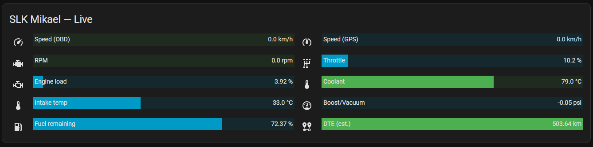

#  [ [FR] Torque Logger 2025 — Intégration Home Assistant ](https://github.com/Marlboro62/homeassistant/blob/main/README.en.md)
#  [ [EN] Torque Logger 2025 — Home Assistant Integration ](https://github.com/Marlboro62/homeassistant/blob/main/README.md) 

**Domain :** `torque_logger_2025` · **Version :** `2025.09.1` · **IoT class :** `local_push`

<p align="center">  
  
</p>

<p align="center">
  <a href="https://img.shields.io/badge/version-2025.09.1-blue.svg"></a>
  <a href="#"></a>
  <a href="#"></a>
  <a href="#"></a>
</p>

Torque Logger 2025 receives **push** data from the **Torque (Android)** app and automatically creates **sensors (PIDs)** + a **`device_tracker`** (vehicle GPS position) in **Home Assistant**.  
It’s simple, fast, and ready for your dashboards. 🔧📈

---

## 🧭 Table of Contents

- [✨ Features](#features)
- [📦 Installation](#installation)
- [⚙️ Configuration in Home Assistant](#configuration-ha)
- [📱 Settings in Torque (Android)](#settings-torque)
- [🧪 Quick Tests (without Torque)](#quick-tests)
- [🛰️ Sensors & GPS tracking](#sensors-gps)
- [🗑️ Remove a vehicle (without removing the integration)](#remove-vehicle)
- [🧰 Troubleshooting](#troubleshooting)
- [🧠 Technical Notes](#technical-notes)
- [🗒️ Changelog](#changelog)
- [🔐 Security & Best Practices](#security)
- [📎 Cards HomeAssistant](#cards)
- [🤝 Acknowledgments](#acknowledgments)

---

<a id="features"></a>
## ✨ Features

- **Auto-creation** of sensors from known **PIDs** (see `const.py`).
- **Device tracker** based on `gpslat` / `gpslon` (real-time GPS position).
- **FR/EN localization** for sensor labels.
- **Unit conversion** (km→mi, °C→°F, km/h→mph, m→ft) via **pint**.
- Noise filter: **optional email filtering** (only your sends are processed).
- **Automatic disambiguation** when two PIDs share the same *short name*.
- **Targeted vehicle removal** directly from Home Assistant’s UI.

---

<a id="installation"></a>
## 📦 Installation

### Option A — via HACS (recommended)
1. Make sure you have **HACS** installed in Home Assistant.
2. Go to **HACS → Integrations → ⋮ → Custom repositories**.
3. Add this repository:  
   **`https://github.com/Marlboro62/homeassistant`**  
   *(Type: **Integration**)*  
> ⚠️ Ensure there are **no spaces** in the URL when copy/pasting.
4. In **HACS → Integrations**, search for **“Torque Logger 2025”**, install it.
5. **Restart** Home Assistant.

### Option B — manual installation
1. Copy the folder `custom_components/torque_logger_2025` into your **Home Assistant** instance.
2. **Restart** Home Assistant.

> ⚠️ **Only one instance** of the integration is supported.

---

<a id="configuration-ha"></a>
## ⚙️ Configuration in Home Assistant
💡 Resources Installation Images: [Voir les images](https://github.com/Marlboro62/homeassistant/tree/main/docs/images/installation)

1. **Settings → Integrations → Add integration → “Torque Logger 2025”**  
2. Fill in:
   - **Email (optional):** if set, only Torque sends with **exactly** this email will be processed.
   - **Imperial units:** automatic conversions.
   - **Language:** `fr` or `en` for labels.

> ℹ️ These options can be changed later via **Integration Options**.

---

<a id="settings-torque"></a>
## 📱 Settings in Torque (Android)

In **Torque Pro**:

1. Enable web server upload  
   *(Data Logging & Upload → Upload to Web Server)*.
2. **Server URL:**  
   http(s)://YOUR_HA:PORT/api/torque_logger_2025
3. *(Recommended)* Enter your **email** in Torque (sent as `eml=...`) — it must **match** if you enabled the filter in the integration.
4. Let Torque send its default parameters (`session`, `id`, `eml`, `profileName`, `time`, `kXX`, etc.).

> 💡 The endpoint does not require authentication by default (direct upload from the phone).  
> If your HA is **exposed to the Internet**, **secure it** (reverse proxy, VPN, allow-list IP) or use the **email filter**.

---

<a id="quick-tests"></a>
## 🧪 Quick Tests (without Torque) with Windows PowerShell

💡 Resources: [See images](https://github.com/Marlboro62/homeassistant/tree/main/docs/images/curl)

**OBD Speed (PID `0x0D`):**
```bash
curl "http://HA:8123/api/torque_logger_2025?session=A1&id=devA&eml=votre@mail.tld&profileName=Ma%20Voiture&v=1.0&time=1694090000&userFullName0d=Vehicle%20speed&userShortName0d=speed&defaultUnit0d=km/h&k0d=250"
curl "https://xxx.duckdns.org/api/torque_logger_2025?session=A1&id=devA&eml=votre@mail.tld&profileName=Ma%20Voiture&v=1.0&time=1694090000&userFullName0d=Vehicle%20speed&userShortName0d=speed&defaultUnit0d=km/h&k0d=250"
```

**Vitesse GPS (PID ff1001) ::**
```bash
curl "http://HA:8123/api/torque_logger_2025?session=A1&id=devA&eml=votre@mail.tld&profileName=Ma%20Voiture&v=1.0&time=1694090100&userFullNameff1001=Vehicle%20speed%20(GPS)&userShortNameff1001=gps_spd&defaultUnitff1001=km/h&kff1001=142"
curl "https://xxx.duckdns.org/api/torque_logger_2025?session=A1&id=devA&eml=votre@mail.tld&profileName=Ma%20Voiture&v=1.0&time=1694090100&userFullNameff1001=Vehicle%20speed%20(GPS)&userShortNameff1001=gps_spd&defaultUnitff1001=km/h&kff1001=142"
```

<a id="sensors-gps"></a>
## 🛰️ Sensors & GPS tracking

Sensors are created **automatically** from the known PIDs declared in `TORQUE_CODES`  
*(see `custom_components/torque_logger_2025/const.py`).*

- `gpslat` / `gpslon` **create** a `device_tracker` (GPS source).
- Non-positional GPS PIDs (*heading, altitude, accuracy, satellites, **GPS speed**, etc.*) are exposed as **regular sensors**.
- In case of **name conflict**, the **sensor name** is **suffixed** with the PID code *(e.g. `-0d`, `-ff1001`)* to remain **unique**.

<a id="remove-vehicle"></a>
## 🗑️ Remove a vehicle (without removing the integration)

**UI path:** `Settings` → `Devices & Services` → `Devices` → *select the vehicle* → menu `⋮` → **Delete device**.

The integration will then **forget** this vehicle and **clean up** its internal references.

<a id="troubleshooting"></a>
## 🧰 Troubleshooting

- **400: Bad Request**: the request has no **`session`**. Torque normally sends it → check the endpoint URL and your `curl` test.
- **No sensors created**: send at least **one known PID** with **metadata** (`userFullNameXX`, `userShortNameXX`, `defaultUnitXX`, `kXX`) **and** a `profileName` (vehicle name).
- **Nothing appears with email filter**: the `eml=` parameter in the request must **exactly match** the email configured in the integration.
- **GPS position missing**: to create the `device_tracker`, Torque must send **`gpslat`** and **`gpslon`** (not just GPS speed). Check Android **Location** permissions for Torque.
- **Duplicate names / sensors**: if two PIDs share the same short name, a suffix `-<pid>` is added automatically (e.g. `-0d`, `-ff1001`). Rename your short names in Torque if needed.
- **Wrong units / language**: change these options via **Integration Options** (restart HA if requested).
- **404 / 403**: check the path **`/api/torque_logger_2025`**, the scheme (`http`/`https`), the HA port, and your reverse-proxy / firewall rules.
- **Too many requests**: reduce upload frequency in Torque (**5–10 s** is enough) to avoid overload.
- **Useful logs**: go to *Settings → System → Logs* or check the file `home-assistant.log` and search for `torque_logger_2025` (switch to `DEBUG` if needed).

### Minimal quick test

# Minimal test with session + profile + 1 known PID
```bash
curl "http://HA:8123/api/torque_logger_2025?session=A1&id=devA&profileName=Ma%20Voiture&time=1694090000&userFullName0d=Vehicle%20speed&userShortName0d=speed&defaultUnit0d=km/h&k0d=250"
curl "https://xxx.duckdns.org/api/torque_logger_2025?session=A1&id=devA&profileName=Ma%20Voiture&time=1694090000&userFullName0d=Vehicle%20speed&userShortName0d=speed&defaultUnit0d=km/h&k0d=250"
```

<a id="technical-notes"></a>
## 🧠 Technical Notes

- **Endpoint:** `GET /api/torque_logger_2025`
- **Email filter:** if configured, only packets where `eml` matches are processed.
- **Localization:** FR / EN labels.
- **Conversions:** via **pint** *(km↔mi, °C↔°F, km/h↔mph, m↔ft)*.
- **Single instance:** only one integration instance is supported.

<a id="changelog"></a>
## 🗒️ Changelog 

### `2025.09.5`
- Added **Config Flow (UI)** integration.
- **FR/EN** label support.
- Option for **Imperial units**.
- **Auto-creation** of sensors (including GPS PIDs other than lat/lon). 💡 Visual HA : [Voir les images](https://github.com/Marlboro62/homeassistant/tree/main/docs/images/capture)
- **Device tracker** based on `gpslat`/`gpslon`. [BUG being resolved]
- **Granular vehicle removal** from UI (without removing the integration).
- ** Added all known Torque PIDs**. 💡 Ressources: [View PIDs](https://github.com/Marlboro62/homeassistant/blob/main/docs/List%20PID%20Torque.md)

<a id="security"></a>
## 🔐 Security & Best Practices

If your HA instance is exposed to the Internet, don’t leave the endpoint **unprotected**:

- **VPN** / **reverse proxy**
- **IP filtering** (allow-list)
- At the very least, enable the **email filter** in the integration

Adjust the **upload frequency** in Torque to avoid overloading the database  
*(5–10 s is enough if you’re not running real-time).*  

<a id="acknowledgments"></a>
## 🤝 Acknowledgments

- **Home Assistant community** & **Torque users**.  
- **Contributors & testers** who make this project more robust every day. 💙  

<a id="cards"></a>
## 📎 Carte / Card HomeAssistant
- **Model / Modele** (https://github.com/Marlboro62/homeassistant/tree/main/docs/images/card/code_card.md). 
<p align="center">
  
</p>

<a id="acknowledgments_s"></a>
## 🌟 Special Thanks

Thanks to the projects developed by:  
- [@junalmeida](https://github.com/junalmeida/homeassistant-torque)  
- [@DominikWrobel](https://github.com/DominikWrobel/homeassistant-torque)  

## 📜 Licence

This project is distributed under the **MIT** license.

It is based on the work of:  
- [@junalmeida](https://github.com/junalmeida)  
- [@DominikWrobel](https://github.com/DominikWrobel)  

The original license files are included and respected. 
You are free to use, modify, and redistribute this project under the terms of the MIT license.   

👉 See the [LICENSE](./LICENSE) file for more details.

## 🛒 Affiliations
<a id="affiliation"></a>
Amazon : <a href="https://amzn.to/48bHmPj" target="_blank" rel="noopener noreferrer">OBD2 Bluetooth</a>

## ☕ Support

If you like this project, you can support me here:  
[](https://ko-fi.com/nothing_one)

<p align="center">
  <a href="#"></a>
</p>


