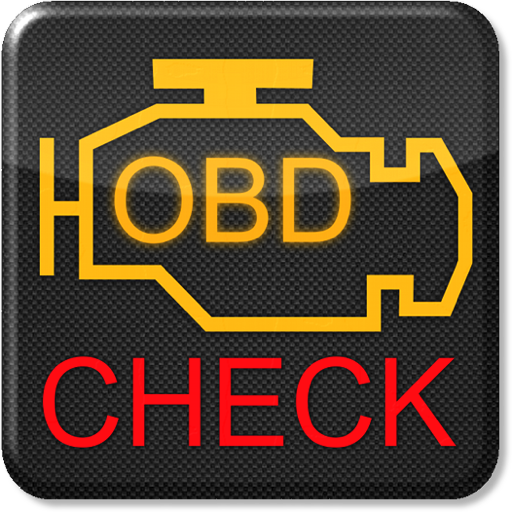

# 🚗 [FR] Torque Logger 2025 — Intégration Home Assistant
# 🚗 [EN] Torque Logger 2025 — Home Assistant Integration  
👉 [README in English](https://github.com/Marlboro62/homeassistant/blob/main/README.en.md)

**Domaine :** `torque_logger_2025` · **Version :** `2025.09.10.37` · **IoT class :** `local_push`

<p align="center">
  
</p>
<p align="center">
  <a href="https://img.shields.io/badge/version-2025.09.10.37-blue.svg"></a>
  <a href="#"></a>
  <a href="#"></a>
  <a href="#"></a>
</p>

Torque Logger 2025 reçoit en **push** les données de l’app **Torque (Android)** et crée automatiquement des **capteurs (PID)** + un **`device_tracker`** (position GPS du véhicule) dans **Home Assistant**.  
C’est simple, rapide, et prêt pour vos tableaux de bord de passionné. 🔧📈

---

## 🧭 Sommaire

- [✨ Fonctionnalités](#fonctionnalites)
- [📦 Installation](#installation)
- [⚙️ Configuration côté Home Assistant](#configuration-ha)
- [📱 Réglages dans Torque (Android)](#reglages-torque)
- [🧪 Tests rapides (sans Torque)](#tests-rapides)
- [🛰️ Capteurs & suivi GPS](#capteurs-gps)
- [🗑️ Supprimer un véhicule (sans enlever l’intégration)](#supprimer-vehicule)
- [🧰 Dépannage](#depannage)
- [🧠 Notes techniques](#notes-techniques)
- [🗒️ Changelog](#changelog)
- [🔐 Sécurité & bonnes pratiques](#securite)
- [📎 Carte HomeAssistant](#carte)
- [🤝 Remerciements](#remerciements)

---

<a id="fonctionnalites"></a>
## ✨ Fonctionnalités

- Création **auto** des capteurs à partir des **PIDs** connus (voir `const.py`).
- **Device tracker** basé sur `gpslat` / `gpslon` (position en temps réel).
- **Localisation FR/EN** des libellés de capteurs.
- **Conversion d’unités** (km→mi, °C→°F, km/h→mph, m→ft) via **pint**.
- Anti-bruit : **filtrage optionnel par email** (seuls vos envois passent).
- **Désambiguïsation automatique** quand deux PIDs portent le même *short name*.
- **Suppression ciblée d’un véhicule** directement depuis l’UI d’Home Assistant.

---

<a id="installation"></a>
## 📦 Installation

### Option A — via HACS (recommandé)
1. Assurez-vous d’avoir **HACS** installé dans Home Assistant.
2. Ouvrez **HACS → Intégrations → ⋮ → Dépôts personnalisés** (*Custom repositories*).
3. Ajoutez ce dépôt :  
   **`https://github.com/Marlboro62/homeassistant`**  
   *(Type : **Intégration**)*  
> ⚠️ Vérifiez qu’il n’y a **pas d’espace** dans l’URL si vous copiez/collez.
4. Dans **HACS → Intégrations**, recherchez **“Torque Logger 2025”**, installez.
5. **Redémarrez** Home Assistant.

### Option B — installation manuelle
1. Copiez le dossier `custom_components/torque_logger_2025` dans votre instance **Home Assistant**.
2. **Redémarrez** Home Assistant.

> ⚠️ **Une seule instance** de l’intégration est autorisée.

---

<a id="configuration-ha"></a>
## ⚙️ Configuration côté Home Assistant

💡 Ressources Images Installation: [Voir les images](https://github.com/Marlboro62/homeassistant/tree/main/docs/images/installation)
1. **Paramètres → Intégrations → Ajouter une intégration → “Torque Logger 2025”**  
2. Renseignez :
   - **Email (facultatif)** : si défini, seuls les envois Torque portant **exactement** cet email seront traités.
   - **Unités impériales** : conversions automatiques.
   - **Langue** : `fr` ou `en` pour les libellés.

> ℹ️ Ces options sont modifiables plus tard via **Options de l’intégration**.

---

<a id="reglages-torque"></a>
## 📱 Réglages dans Torque (Android)

Dans **Torque Pro** :

1. Activez l’upload vers serveur web  
   *(Data Logging & Upload → Upload to Web Server)*.
2. **URL du serveur :**
     http(s)://VOTRE_HA:PORT/api/torque_logger_2025
3. *(Conseillé)* Renseignez **votre email** dans Torque (champ envoyé en `eml=...`) — il doit **correspondre** si vous avez activé le filtre côté intégration.
4. Laissez Torque envoyer ses paramètres par défaut (`session`, `id`, `eml`, `profileName`, `time`, `kXX`, etc.).

> 💡 L’endpoint n’exige pas d’authentification par défaut (upload direct depuis le téléphone).  
> Si votre HA est **exposé sur Internet**, **protégez-le** (reverse proxy, VPN, allow-list IP) ou utilisez le **filtre email**.

---

<a id="tests-rapides"></a>
## 🧪 Tests rapides (sans Torque) avec PowerShell Windows

💡 Ressources BASH : [Voir les images](https://github.com/Marlboro62/homeassistant/tree/main/docs/images/curl)

**Vitesse OBD (PID `0x0D`) :**
```bash
curl "http://HA:8123/api/torque_logger_2025?session=A1&id=devA&eml=votre@mail.tld&profileName=Ma%20Voiture&v=1.0&time=1694090000&userFullName0d=Vehicle%20speed&userShortName0d=speed&defaultUnit0d=km/h&k0d=250"
curl "https://xxx.duckdns.org/api/torque_logger_2025?session=A1&id=devA&eml=votre@mail.tld&profileName=Ma%20Voiture&v=1.0&time=1694090000&userFullName0d=Vehicle%20speed&userShortName0d=speed&defaultUnit0d=km/h&k0d=250"
```

**Vitesse GPS (PID ff1001) ::**
```bash
curl "http://HA:8123/api/torque_logger_2025?session=A1&id=devA&eml=votre@mail.tld&profileName=Ma%20Voiture&v=1.0&time=1694090100&userFullNameff1001=Vehicle%20speed%20(GPS)&userShortNameff1001=gps_spd&defaultUnitff1001=km/h&kff1001=142"
curl "https://xxx.duckdns.org/api/torque_logger_2025?session=A1&id=devA&eml=votre@mail.tld&profileName=Ma%20Voiture&v=1.0&time=1694090100&userFullNameff1001=Vehicle%20speed%20(GPS)&userShortNameff1001=gps_spd&defaultUnitff1001=km/h&kff1001=142"
```

<a id="capteurs-gps"></a>
## 🛰️ Capteurs & suivi GPS

Les capteurs sont créés **automatiquement** à partir des PIDs connus déclarés dans `TORQUE_CODES`  
*(voir `custom_components/torque_logger_2025/const.py`).*

- `gpslat` / `gpslon` **créent** un `device_tracker` (source GPS).
- Les PIDs GPS **non positionnels** (*cap*, altitude, précision, satellites, **vitesse GPS**, etc.) sont exposés en **capteurs classiques**.
- En cas de **conflit de nom**, le **nom du capteur** est **suffixé** par le code PID *(p. ex. `-0d`, `-ff1001`)* afin de rester **unique**.

<a id="supprimer-vehicule"></a>
## 🗑️ Supprimer un véhicule (sans enlever l’intégration)

**Chemin UI :** `Paramètres` → `Appareils & Services` → `Appareils` → *sélectionnez le véhicule* → menu `⋮` → **Supprimer l’appareil**.

L’intégration **oublie** alors ce véhicule et **nettoie** ses références internes.

<a id="depannage"></a>
## 🧰 Dépannage

- **400: Bad Request** : la requête n’a **pas de `session`**. Torque l’envoie normalement → vérifiez l’URL de l’endpoint et votre test `curl`.
- **Aucun capteur créé** : envoyez au moins **un PID connu** avec **métadonnées** (`userFullNameXX`, `userShortNameXX`, `defaultUnitXX`, `kXX`) **et** un `profileName` (nom du véhicule).
- **Rien n’apparaît avec filtre e-mail** : le paramètre `eml=` dans la requête doit **correspondre exactement** à l’e-mail configuré dans l’intégration.
- **Position GPS absente** : pour créer le `device_tracker`, Torque doit envoyer **`gpslat`** et **`gpslon`** (pas seulement la vitesse GPS). Vérifiez les permissions **Localisation** d’Android pour Torque.
- **Noms en doublon / capteurs dupliqués** : si deux PIDs partagent le même *short name*, un suffixe `-<pid>` est ajouté automatiquement (ex. `-0d`, `-ff1001`). Renommez vos *short names* côté Torque si nécessaire.
- **Unités / langue incorrectes** : modifiez ces options via **Options** de l’intégration (redémarrez HA si demandé).
- **404 / 403** : vérifiez le chemin **`/api/torque_logger_2025`**, le schéma (`http`/`https`), le port de HA et les règles de votre reverse-proxy / pare-feu.
- **Trop de requêtes** : réduisez la fréquence d’upload dans Torque (**5–10 s** suffisent) pour éviter la surcharge.
- **Logs utiles** : ouvrez *Paramètres → Système → Journaux* ou le fichier `home-assistant.log` et cherchez `torque_logger_2025` (passez en niveau `DEBUG` si besoin).

### Exemple de test rapide

# Test minimal avec session + profil + 1 PID connu
```bash
curl "http://HA:8123/api/torque_logger_2025?session=A1&id=devA&profileName=Ma%20Voiture&time=1694090000&userFullName0d=Vehicle%20speed&userShortName0d=speed&defaultUnit0d=km/h&k0d=250"
curl "https://xxx.duckdns.org/api/torque_logger_2025?session=A1&id=devA&profileName=Ma%20Voiture&time=1694090000&userFullName0d=Vehicle%20speed&userShortName0d=speed&defaultUnit0d=km/h&k0d=250"
```

<a id="notes-techniques"></a>
## 🧠 Notes techniques

- **Endpoint** : `GET /api/torque_logger_2025`
- **Filtre e-mail** : si configuré, seuls les paquets dont `eml` correspond sont traités.
- **Localisation** : libellés **fr / en**.
- **Conversions** : via **pint** *(km↔mi, °C↔°F, km/h↔mph, m↔ft)*.
- **Instance unique** : une seule instance de l’intégration est supportée.

<a id="changelog"></a>
## 🗒️ Changelog

### `2025.09.5.37`
- Intégration **Config Flow (UI)**.
- **FR/EN** pour les libellés.
- Option **Unités impériales**.
- **Création automatique** des capteurs (incluant PIDs GPS hors lat/lon). 💡 Visuel HA : [Voir les images](https://github.com/Marlboro62/homeassistant/tree/main/docs/images/capture)
- **Device tracker** basé sur `gpslat`/`gpslon`.
- **Suppression fine** d’un véhicule depuis l’UI (sans retirer l’intégration).
- ** Ajout de tous les PID connu de Torque**. 💡 Ressources: [Voir les PID](https://github.com/Marlboro62/homeassistant/blob/main/docs/List%20PID%20Torque.md)

<a id="securite"></a>
## 🔐 Sécurité & bonnes pratiques

Si votre instance HA est accessible depuis Internet, ne laissez pas l’endpoint exposé **sans protection** :

- **VPN** / **reverse proxy**
- **Filtrage IP** (allow-list)
- À défaut, activez le **filtre e-mail** côté intégration

Ajustez la **fréquence d’upload** dans Torque pour éviter de surcharger la base  
*(5–10 s suffisent si vous n’êtes pas en temps réel).*

<a id="remerciements"></a>
## 🤝 Remerciements
- **Communauté Home Assistant** & utilisateurs de **Torque**.  
- **Contributeurs & testeurs** qui rendent ce projet plus robuste chaque jour. 💙  

<a id="carte"></a>
## 📎 Carte / Card HomeAssistant
- **Modele / Model** (https://github.com/Marlboro62/homeassistant/tree/main/docs/images/card/code_card.md). 
<p align="center">
  
</p>

<a id="remerciements_s"></a>
## 🌟 Remerciements spéciaux
Merci aux projets développés par :  
- [@junalmeida](https://github.com/junalmeida/homeassistant-torque)  
- [@DominikWrobel](https://github.com/DominikWrobel/homeassistant-torque)  

## 📜 Licence

Ce projet est distribué sous licence **MIT**.

Il est basé sur les travaux de :  
- [@junalmeida](https://github.com/junalmeida)  
- [@DominikWrobel](https://github.com/DominikWrobel)  

Les fichiers de licence originaux sont inclus et respectés.  
Vous êtes libre d’utiliser, modifier et redistribuer ce projet conformément aux termes de la licence MIT.  

👉 Voir le fichier [LICENSE](./LICENSE) pour plus de détails.


## 🛒 Affiliations
<a id="affiliation"></a>
Amazon : <a href="https://amzn.to/48bHmPj" target="_blank" rel="noopener noreferrer">OBD2 Bluetooth</a>

## ☕ Support

Si vous aimez ce projet, vous pouvez me soutenir ici :  
[](https://ko-fi.com/nothing_one)

<p align="center">
  <a href="#"></a>
</p>

